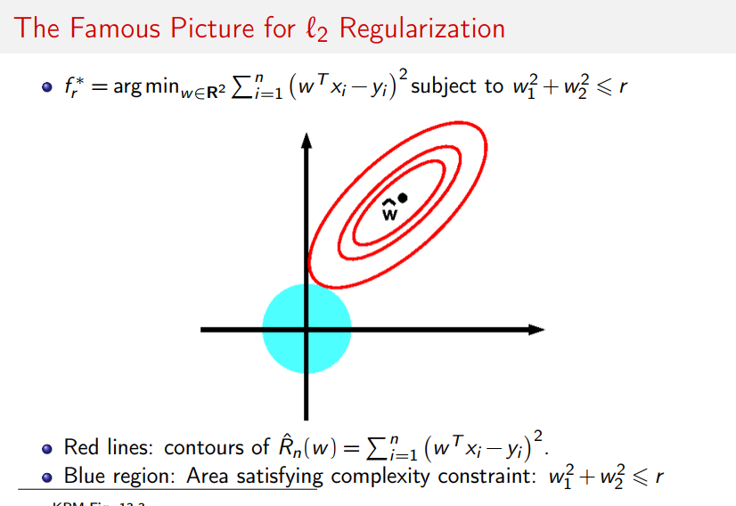

# Common Data science interview questions and answers

### What is regularization? The differences between Lasso vs Ridge?
- Regulization is a process of adding a tuning parameter to a model to induce smoothness of the weights (prevent the coefficients to fit so perfectly) in order to prevent overfitting.
- Lasso formula:  
 
  

  

Ridge formula:  

   
Lasso vs. Ridge comparison:  

   

       

Check out this wonderful post: [Differences between L1 and L2 as Loss Function and Regularization](http://www.chioka.in/differences-between-l1-and-l2-as-loss-function-and-regularization/)  

### Derive the ordinary least square regression formula
[Derivation](http://cs229.stanford.edu/notes/cs229-notes1.pdf)

### How to deal with overfitting?
1. Train with more data  
2. Cross validation  
3. Do feature selection  
4. Use early stopping if possible  
5. Regulization  
6. Ensembling  
Reference: [overfitting in machine learning algorithms](https://elitedatascience.com/overfitting-in-machine-learning#how-to-prevent)

### If I double every sample observation in a linear regression model, how will the coefficients, r-squared value and t-value change?

Coefficients will be the same (obviously).

Let's consider what is r-squared value?
[Here](https://onlinecourses.science.psu.edu/stat501/node/255/)'s a detaild introduction to r-squared.
> "r2 ×100 percent of the variation in y is 'explained by' the variation in predictor x."
Scaling the sample doesn't affect Xi's ability to 'explain' Y, so the r-squared should remain the same.

t-value will be sqrt(2) times bigger which is pretty obvious from the fomula of t-value: 

  

### What’s the disadvantages of linear regression?
1. Linear regression is sensitive to outliers
2. Linear regression is only capable of describing linear relationship, so non-linear relationship needs to be transformed before putting into the model.
3. Linear regression assumes data are independent.

### Explain what precision and recall are. How do they relate to the ROC curve?

